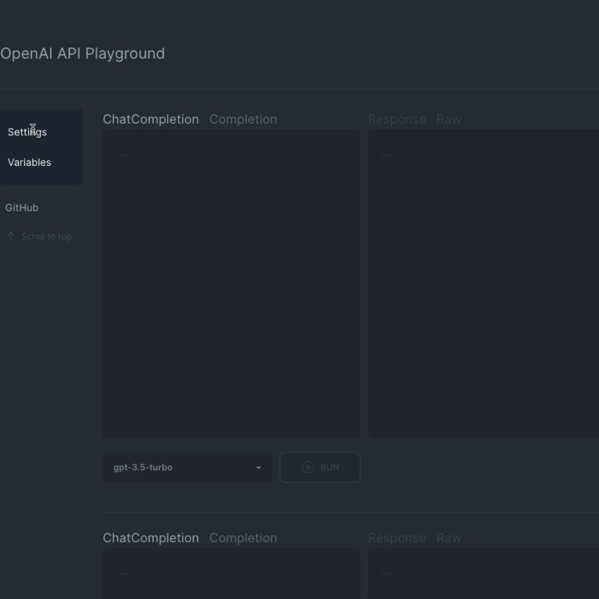

# 🏟️ OpenAI API Playground



<p align="center">
<strong>An alternative UI for playing with ChatGPT: https://openai-api-playground.raychen.io</strong>
</p>

## Features

* Add and try out multiple prompts in a single screen
* Support for setting and injecting variables into prompts
* Everything is local - your API key is not stored or sent to any servers
(except OpenAI's for fulfilling requests)

## Usage

https://openai-api-playground.raychen.io

### Variables

You can set and inject variables into prompts using `{{ $VAR }}`,
where `$VAR` is the name of the variable.

## Self-hosting

This project is a static Next/React app. You can deploy it on any static site
hosts (GitHub Pages, Cloudflare Pages, Netlify, etc.), use it locally, or
point a webserver at `index.html`.

To generate a build, run:

```sh
$ yarn build
```

The build will be available in the `out` directory in the project root.

## License

[MIT](LICENSE)
